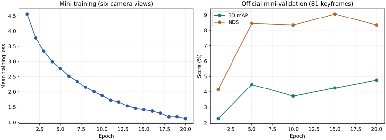

# First entropy-fusion mini experiment

Completed September 13, 2026: **20 epochs / 38,760 training steps** in
**31.7 minutes**, including five official validation passes.
Training used all six camera views of 323 keyframes in eight mini training scenes;
validation used all 486 views of 81 keyframes in the two held-out scenes.

The starting code was commit `6700046a6b8fd922d434d729e02e3c54c4322419`. Settings stayed fixed:
640 x 384, batch 1, FP32, two workers, AdamW LR 1e-4, seed 42 and p=0.5 modality
dropout. The camera started from ImageNet weights and other modules from random
initialization. Checkpoints preserved optimizer/RNG state between validation stages.
No full-dataset training was started.

| Epoch | Official 3D mAP | NDS |
| --- | --- | --- |
| 1 | 2.27% | 4.16% |
| 5 | 4.48% | 8.44% |
| 10 | 3.73% | 8.33% |
| 15 | 4.25% | 9.05% |
| 20 | 4.76% | 8.33% |

**Best by validation mAP: epoch 20 (4.76%).**
The selection rule was fixed to mAP. The best checkpoint is
`outputs/mini_20epoch_20260913/best.pt`; the final checkpoint is
`outputs/mini_20epoch_20260913/training/last.pt`. Numbered checkpoints and validation
outputs at epochs 1/5/10/15/20 are retained. These local files are ignored by Git.

Mean training loss fell from **4.554** at epoch 1 to
**1.124** at epoch 20. Peak PyTorch memory was
**0.368 GiB allocated / 0.414 GiB reserved**;
CUDA context and driver memory are additional. All steps had finite losses and
gradients, with no skipped updates. Both best and final checkpoints were reopened,
checked for finite weights and expected optimizer-step counts; best.pt matches its
numbered epoch checkpoint. Every scheduled evaluation covered the whole mini_val
split and passed the official devkit.

## Interpretation

The model learns the training scenes, but held-out accuracy remains low. Training
loss reduction is not evidence of comparable generalization. This small split is
useful for finding pipeline and optimization problems, not establishing competitive
3D detection or adverse-weather robustness.

Per-class AP at the checkpoint selected by overall mAP:

| Class | AP |
| --- | --- |
| car | 12.45% |
| truck | 0.82% |
| bus | 0.00% |
| trailer | 0.00% |
| construction_vehicle | 0.00% |
| pedestrian | 9.88% |
| motorcycle | 0.00% |
| bicycle | 0.00% |
| traffic_cone | 24.44% |
| barrier | 0.00% |

The mini validation scenes contain no point-supported trailer, construction-vehicle,
or barrier annotations. Class counts in the JSON record count keyframe annotations
with at least one LiDAR/radar point before range and bike-rack filtering; they are
not duplicated across camera views. This limited coverage and class imbalance
restrict what can be concluded from mini. All metric values above use the official
ten-class evaluator, including its zero-AP handling of classes without positives.

The next experiment should investigate the validation plateau and inspect 3D
predictions before committing to a long full-data run. Depth regression, class
sampling, regularization and multi-view merging remain unvalidated design choices.
Full-data input integrity (including radar and unresolved archive MD5 differences)
still needs checking before full training.

The [machine-readable results](mini_20epoch_results.json) record each epoch's losses,
all validation results, class counts and checkpoint checks. Raw logs and PNG curves
are in `outputs/mini_20epoch_20260913/`. See [training instructions](TRAINING.md) to
repeat the run. Training is finished and no experiment process remains active.
